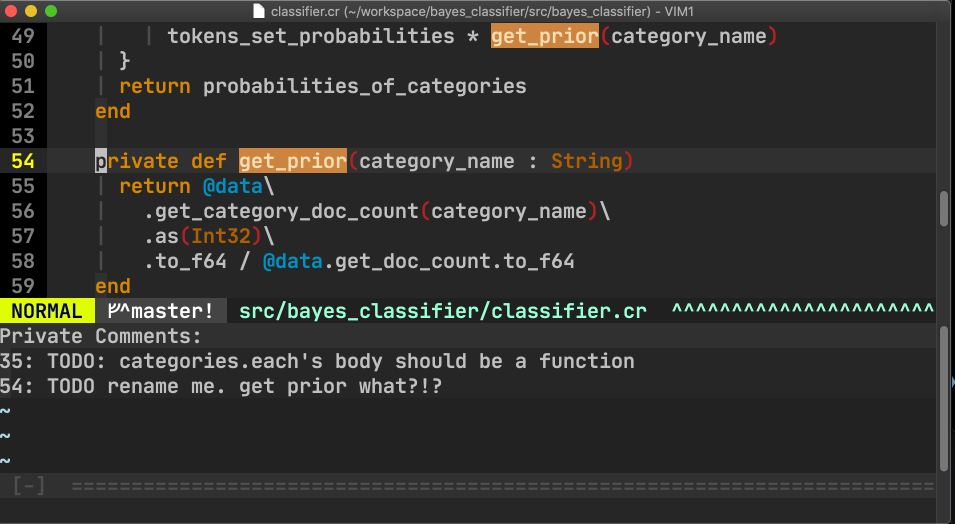
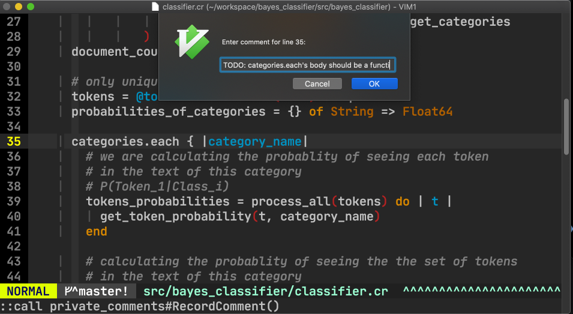

# Vim support for Private Comments

[Private Comments](https://github.com/masukomi/private_comments/) allows you to record comments _in_ your code that aren't _in_ the codebase.  

This plugin allows you to integrate Vim with Private Comments.



These comments are tied to the specific version of the lines they comment on. When the lines are updated the comments will disappear, but you'll see them if you use git to roll your repository back to the version of the code where it was created. 

You can easily jump to the location associated with one of the comments by putting your cursor on it and typing `:pcj` (short for **P**rivate **C**omments **J**ump).

Comment input leverages the GUI if you're using one, or happens within Vim's "Command Line" if you aren't. The comment is automatically associated with the line your cursor is currently on. 



Note: Private Comments can only record comments about _committed_ lines. So, if it's a new line, or you've changed the line, you'll need to commit it before commenting.


## Requirements

* The [Private Comments](https://github.com/masukomi/private_comments/) server must be running locally
* The `pc` client (part of private comments) must be in your `$PATH`[^1]
* The [git](https://git-scm.com/) command line client must be installed and also in your `$PATH`. 

If you've installed private comments and git with a package manager like Homebrew, they're already in your path. If you've done things manually here's [how to add directories to your path in linux](https://www.techrepublic.com/article/how-to-add-directories-to-your-path-in-linux/).

## Installation

This plugin follows the standard runtime path structure, and as such it can be installed with a variety of plugin managers:

| Plugin Manager | Install with... |
| ------------- | ------------- |
| [Pathogen][1] | `git clone https://github.com/masukomi/vim_private_comments ~/.vim/bundle/vim-airline`<br/>Remember to run `:Helptags` to generate help tags |
| [NeoBundle][2] | `NeoBundle 'masukomi/vim_private_comments'` |
| [Vundle][3] | `Plugin 'masukomi/vim_private_comments'` |
| [Plug][4] | `Plug 'masukomi/vim_private_comments'` |
| [VAM][5] | `call vam#ActivateAddons([ 'vim-airline' ])` |
| [Dein][6] | `call dein#add('masukomi/vim_private_comments')` |
| [minpac][7] | `call minpac#add('masukomi/vim_private_comments')` |
| pack feature (native Vim 8 package feature)| `git clone https://github.com/masukomi/vim_private_comments ~/.vim/pack/dist/start/vim-airline`<br/>Remember to run `:helptags` to generate help tags |
| manual | copy all of the files into your `~/.vim` directory |


Vim Plug: `Plug 'masukomi/vim_private_comments'`  

Alternately, however your preferred plugin manager generally installs vim plugins on GitHub.

## Usage
Add the following aliases to your `~/.vimrc` to create aliases for each of the four Private Comments commands. Then reload your ~/.vimrc or restart vim (for instructions on editing your ~/.vimrc see [Editing Your .vimrc file on Vim.works](https://vim.works/2017/04/05/editing-your-.vimrc-file/))

```vim
:cabbr pcv :call private_comments#View()
:cabbr pcj :call private_comments#JumpToCommentLine()
:cabbr pcr :call private_comments#RecordComment()
:cabbr pcd :call private_comments#DeleteComment()
:cabbr pcc :call private_comments#ClosePCWindow()
```

### Explanation

* `:pcv` -> (v for View) Views the private comments for the current file.
* `:pcr` -> (r for Record) Records a private comment for the current line of the current file.
* `:pcd` -> (d for Delete) Deletes the private comment on the current line.
* `:pcj` -> (j for Jump) Jump you to the comment about the specified line.
  * Run from within the private comments listing this will look for the `<number>:` at the start of the comment line and jump to that line in your main editor window. These line numbers are auto-generated so you don't have to put them in your comment.
* `:pcc` -> (c for Close) closes the private comments window.
  * Switching to the private comments window and running `:q` works fine too. ;)


You can find help docs at `:help PrivateComments`

## License
[MIT][8]

----

^1: Note: [This article](https://medium.com/@jalendport/what-exactly-is-your-shell-path-2f076f02deb4) describes [PATH] and how to work with it if you're unfamiliar.


[1]: https://github.com/tpope/vim-pathogen
[2]: https://github.com/Shougo/neobundle.vim
[3]: https://github.com/VundleVim/Vundle.vim
[4]: https://github.com/junegunn/vim-plug
[5]: https://github.com/MarcWeber/vim-addon-manager
[6]: https://github.com/Shougo/dein.vim
[7]: https://github.com/k-takata/minpac/
[8]: https://github.com/masukomi/vim_private_comments/blob/master/LICENSE.md

